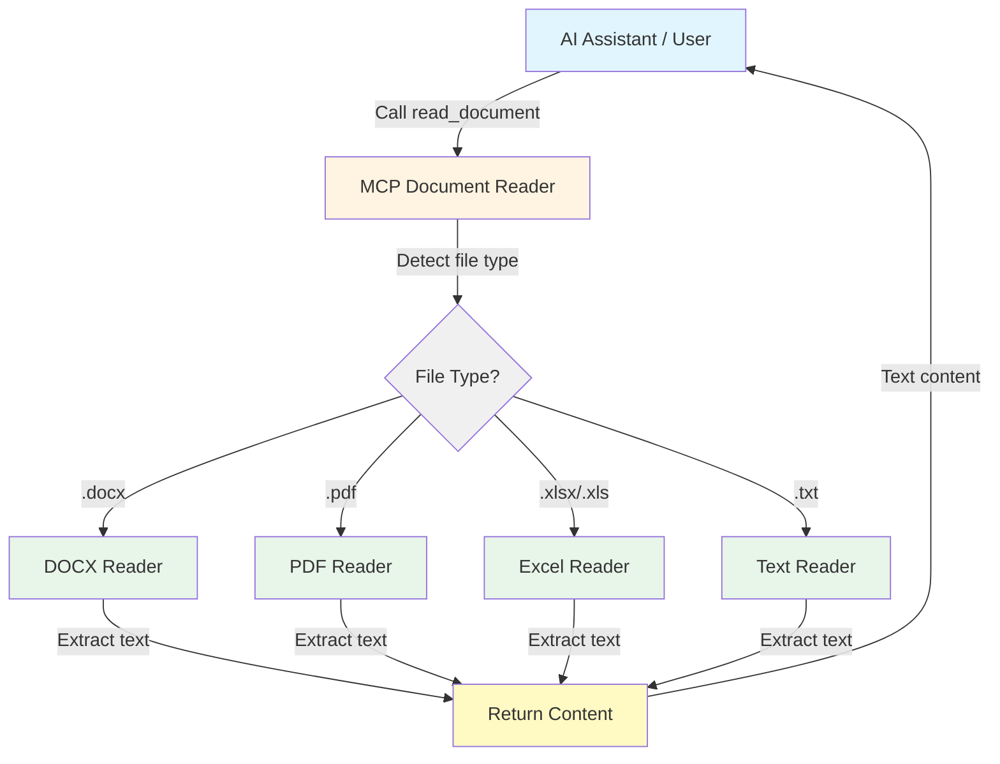

<h1 align="center">MCP Document Reader</h1>

<!-- mcp-name: io.github.xt765/mcp_documents_reader -->

<p align="center"><strong>MCP (Model Context Protocol) Document Reader - A powerful MCP tool for reading documents in multiple formats, enabling AI agents to truly "read" your documents.</strong></p>

<p align="center">🌐 <strong>Language</strong>: <a href="README.md">English</a> | <a href="README.zh-CN.md">中文</a></p>

<p align="center">
  <a href="https://blog.csdn.net/Yunyi_Chi"></a>
  <a href="https://github.com/xt765/mcp_documents_reader"></a>
  <a href="https://gitee.com/xt765/mcp_documents_reader"></a>
</p>
<p align="center">
  <a href="LICENSE"></a>
  <a href="https://www.python.org/downloads/"></a>
  <a href="https://pypi.org/project/mcp-documents-reader/"></a>
  <a href="https://pepy.tech/project/mcp-documents-reader"></a>
  <a href="https://registry.modelcontextprotocol.io/v0.1/servers?search=io.github.xt765/mcp_documents_reader"></a>
  <a href="https://mcp-marketplace.io/server/io-github-xt765-mcp-documents-reader"></a>
</p>

## Features

- **Multi-format Support**: Supports 4 mainstream document formats: Excel (XLSX/XLS), DOCX, PDF, and TXT
- **MCP Protocol**: Compliant with MCP standards, can be used as a tool for AI assistants like Trae IDE
- **Easy Integration**: Simple configuration for immediate use
- **Reliable Performance**: Successfully tested and running in Trae IDE
- **File System Support**: Reads documents directly from the file system

---

## 📚 Documentation

[User Guide](docs/en/USER_GUIDE.md) · [API Reference](docs/en/API.md) · [Contributing](docs/en/CONTRIBUTING.md) · [Changelog](docs/en/CHANGELOG.md) · [License](LICENSE)

---

## Architecture



## Supported Formats

| Format | Extensions | MIME Type | Features |
|--------|------------|-----------|----------|
| Excel | .xlsx, .xls | application/vnd.openxmlformats-officedocument.spreadsheetml.sheet | Sheet and cell data extraction |
| DOCX | .docx | application/vnd.openxmlformats-officedocument.wordprocessingml.document | Text and structure extraction |
| PDF | .pdf | application/pdf | Text extraction |
| Text | .txt | text/plain | Plain text reading |

## Installation

### Using pip (Recommended)

```bash
pip install mcp-documents-reader
```

### From Source

```bash
git clone https://github.com/xt765/mcp_documents_reader.git
cd mcp_documents_reader
pip install -e .
```

## MCP Tools

This server provides the following tool:

### `read_document`

Read any supported document type with a unified interface.

**Arguments:**
- `filename` (string, required): Document file path, supports absolute or relative paths.

## Configuration

### Using in Trae IDE / Claude Desktop

Add the following to your MCP configuration file:

**Option 1: Using PyPI (Recommended)**

```json
{
  "mcpServers": {
    "mcp-document-reader": {
      "command": "uvx",
      "args": [
        "mcp-documents-reader"
      ]
    }
  }
}
```

**Option 2: Using GitHub repository**

```json
{
  "mcpServers": {
    "mcp-document-reader": {
      "command": "uvx",
      "args": [
        "--from",
        "git+https://github.com/xt765/mcp_documents_reader",
        "mcp_documents_reader"
      ]
    }
  }
}
```

**Option 3: Using Gitee repository (Faster access in China)**

```json
{
  "mcpServers": {
    "mcp-document-reader": {
      "command": "uvx",
      "args": [
        "--from",
        "git+https://gitee.com/xt765/mcp_documents_reader",
        "mcp_documents_reader"
      ]
    }
  }
}
```

## Usage

### As an MCP Tool

After configuration, AI assistants can directly call the following tool:

```python
# Read a DOCX file
read_document(filename="example.docx")

# Read a PDF file
read_document(filename="example.pdf")

# Read an Excel file
read_document(filename="example.xlsx")

# Read a text file
read_document(filename="example.txt")
```

### As a Python Library

```python
from mcp_documents_reader import DocumentReaderFactory

# Using factory (recommended)
reader = DocumentReaderFactory.get_reader("document.pdf")
content = reader.read("/path/to/document.pdf")

# Check if format is supported
if DocumentReaderFactory.is_supported("file.xlsx"):
    reader = DocumentReaderFactory.get_reader("file.xlsx")
    content = reader.read("/path/to/file.xlsx")
```

## Tool Interface Details

### read_document

Read any supported document type.

**Parameters:**

| Parameter | Type | Required | Description |
|-----------|------|----------|-------------|
| filename | string | ✅ | Document file path, supports absolute or relative paths |

## Environment Variables

| Variable | Description | Default |
|----------|-------------|---------|
| `DOCUMENT_DIRECTORY` | Directory where documents are stored | `./documents` |

## Dependencies

### Core Dependencies
- `mcp` >= 0.1.0 - MCP protocol implementation
- `python-docx` >= 0.8.11 - DOCX file reading
- `PyPDF2` >= 3.0.1 - PDF file reading
- `openpyxl` >= 3.0.10 - Excel file reading

### Development Dependencies
- `pytest` >= 8.0.0 - Testing framework
- `pytest-asyncio` >= 0.24.0 - Async testing support
- `pytest-cov` >= 6.0.0 - Coverage reporting
- `basedpyright` >= 0.28.0 - Type checking
- `ruff` >= 0.8.0 - Linting and formatting

## License

MIT License

## Contributing

Issues and Pull Requests are welcome!

## Related Projects

- [MCP Document Converter](https://github.com/xt765/mcp-document-converter) - MCP document converter supporting multiple format conversions
- [Model Context Protocol](https://modelcontextprotocol.io/) - Official Model Context Protocol documentation
