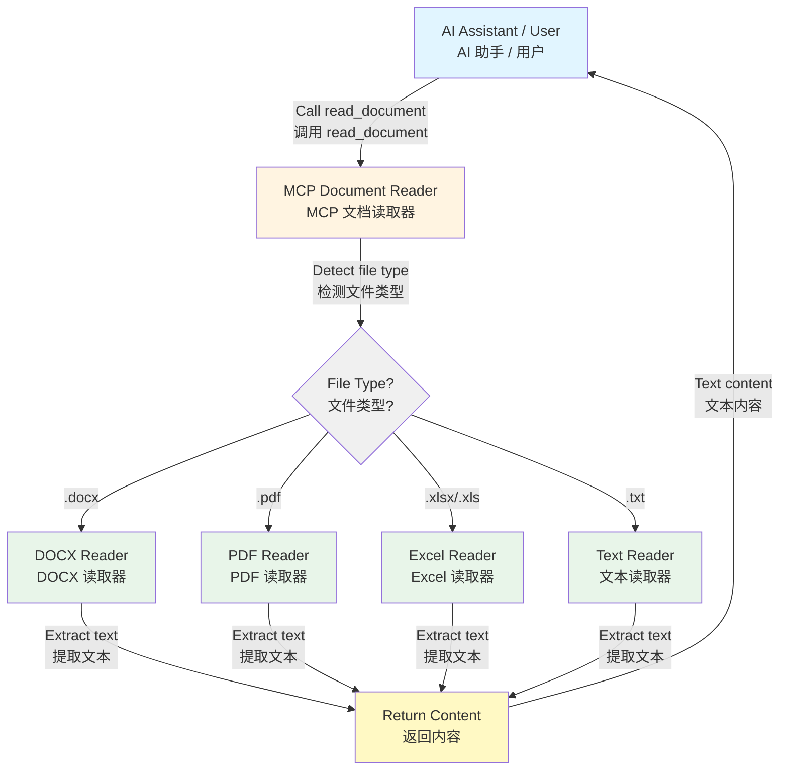

<h1 align="center">MCP Document Reader (MCP 文档读取器)</h1>

<!-- mcp-name: io.github.xt765/mcp_documents_reader -->

<p align="center"><strong>MCP（模型上下文协议）文档读取器 - 一个强大的 MCP 工具，用于读取多种格式的文档，使 AI 智能体能够真正"读取"您的文档。</strong></p>

<p align="center">🌐 <strong>语言</strong>: <a href="README.md">English</a> | <a href="README.zh-CN.md">中文</a></p>

<p align="center">
  <a href="https://blog.csdn.net/Yunyi_Chi"></a>
  <a href="https://github.com/xt765/mcp_documents_reader"></a>
  <a href="https://gitee.com/xt765/mcp_documents_reader"></a>
</p>
<p align="center">
  <a href="LICENSE"></a>
  <a href="https://www.python.org/downloads/"></a>
  <a href="https://pypi.org/project/mcp-documents-reader/"></a>
  <a href="https://pepy.tech/project/mcp-documents-reader"></a>
  <a href="https://registry.modelcontextprotocol.io/v0.1/servers?search=io.github.xt765/mcp_documents_reader"></a>
  <a href="https://mcp-marketplace.io/server/io-github-xt765-mcp-documents-reader"></a>
</p>

## 功能特性

- **多格式支持**：支持 4 种主流文档格式：Excel（XLSX/XLS）、DOCX、PDF 和 TXT
- **MCP 协议**：符合 MCP 标准，可作为 AI 助手（如 Trae IDE）的工具使用
- **易于集成**：简单配置即可立即使用
- **可靠性能**：已在 Trae IDE 中成功测试运行
- **文件系统支持**：直接从文件系统读取文档

---

## 📚 文档中心

[用户指南](docs/zh/USER_GUIDE.md) · [API 参考](docs/zh/API.md) · [贡献指南](docs/zh/CONTRIBUTING.md) · [更新日志](docs/zh/CHANGELOG.md) · [许可证](LICENSE)

---

## 架构



## 支持的格式

| 格式 | 扩展名 | MIME 类型 | 特性 |
|------|--------|-----------|------|
| Excel | .xlsx, .xls | application/vnd.openxmlformats-officedocument.spreadsheetml.sheet | 工作表和单元格数据提取 |
| DOCX | .docx | application/vnd.openxmlformats-officedocument.wordprocessingml.document | 文本和结构提取 |
| PDF | .pdf | application/pdf | 文本提取 |
| Text | .txt | text/plain | 纯文本读取 |

## 安装

### 使用 pip (推荐)

```bash
pip install mcp-documents-reader
```

### 从源码安装

```bash
git clone https://github.com/xt765/mcp_documents_reader.git
cd mcp_documents_reader
pip install -e .
```

## MCP 工具

本服务器提供以下工具：

### `read_document`

使用统一接口读取任何支持的文档类型。

**参数：**
- `filename` (string, 必填): 文档文件路径，支持绝对路径或相对路径。

## 配置

### 在 Trae IDE / Claude Desktop 中使用

将以下内容添加到您的 MCP 配置文件中：

**选项 1：使用 PyPI (推荐)**

```json
{
  "mcpServers": {
    "mcp-document-reader": {
      "command": "uvx",
      "args": [
        "mcp-documents-reader"
      ]
    }
  }
}
```

**选项 2：使用 GitHub 仓库**

```json
{
  "mcpServers": {
    "mcp-document-reader": {
      "command": "uvx",
      "args": [
        "--from",
        "git+https://github.com/xt765/mcp_documents_reader",
        "mcp_documents_reader"
      ]
    }
  }
}
```

**选项 3：使用 Gitee 仓库（国内访问更快）**

```json
{
  "mcpServers": {
    "mcp-document-reader": {
      "command": "uvx",
      "args": [
        "--from",
        "git+https://gitee.com/xt765/mcp_documents_reader",
        "mcp_documents_reader"
      ]
    }
  }
}
```

## 使用方法

### 作为 MCP 工具使用

配置完成后，AI 助手可以直接调用以下工具：

```python
# 读取 DOCX 文件
read_document(filename="example.docx")

# 读取 PDF 文件
read_document(filename="example.pdf")

# 读取 Excel 文件
read_document(filename="example.xlsx")

# 读取文本文件
read_document(filename="example.txt")
```

### 作为 Python 库使用

```python
from mcp_documents_reader import DocumentReaderFactory

# 使用工厂类（推荐）
reader = DocumentReaderFactory.get_reader("document.pdf")
content = reader.read("/path/to/document.pdf")

# 检查格式是否支持
if DocumentReaderFactory.is_supported("file.xlsx"):
    reader = DocumentReaderFactory.get_reader("file.xlsx")
    content = reader.read("/path/to/file.xlsx")
```

## 工具接口详情

### read_document

读取任何支持的文档类型。

**参数：**

| 参数 | 类型 | 必填 | 描述 |
|------|------|------|------|
| filename | string | ✅ | 文档文件路径，支持绝对路径或相对路径 |

## 环境变量

| 变量名 | 描述 | 默认值 |
|--------|------|--------|
| `DOCUMENT_DIRECTORY` | 存储文档的目录 | `./documents` |

## 依赖

### 核心依赖
- `mcp` >= 0.1.0 - MCP 协议实现
- `python-docx` >= 0.8.11 - DOCX 文件读取
- `PyPDF2` >= 3.0.1 - PDF 文件读取
- `openpyxl` >= 3.0.10 - Excel 文件读取

### 开发依赖
- `pytest` >= 8.0.0 - 测试框架
- `pytest-asyncio` >= 0.24.0 - 异步测试支持
- `pytest-cov` >= 6.0.0 - 覆盖率报告
- `basedpyright` >= 0.28.0 - 类型检查
- `ruff` >= 0.8.0 - 代码检查和格式化

## 许可证

MIT License

## 贡献

欢迎提交 Issue 和 Pull Request！

## 相关项目

- [MCP Document Converter](https://github.com/xt765/mcp-document-converter) - MCP 文档转换器，支持多种格式转换
- [Model Context Protocol](https://modelcontextprotocol.io/) - 模型上下文协议官方文档
